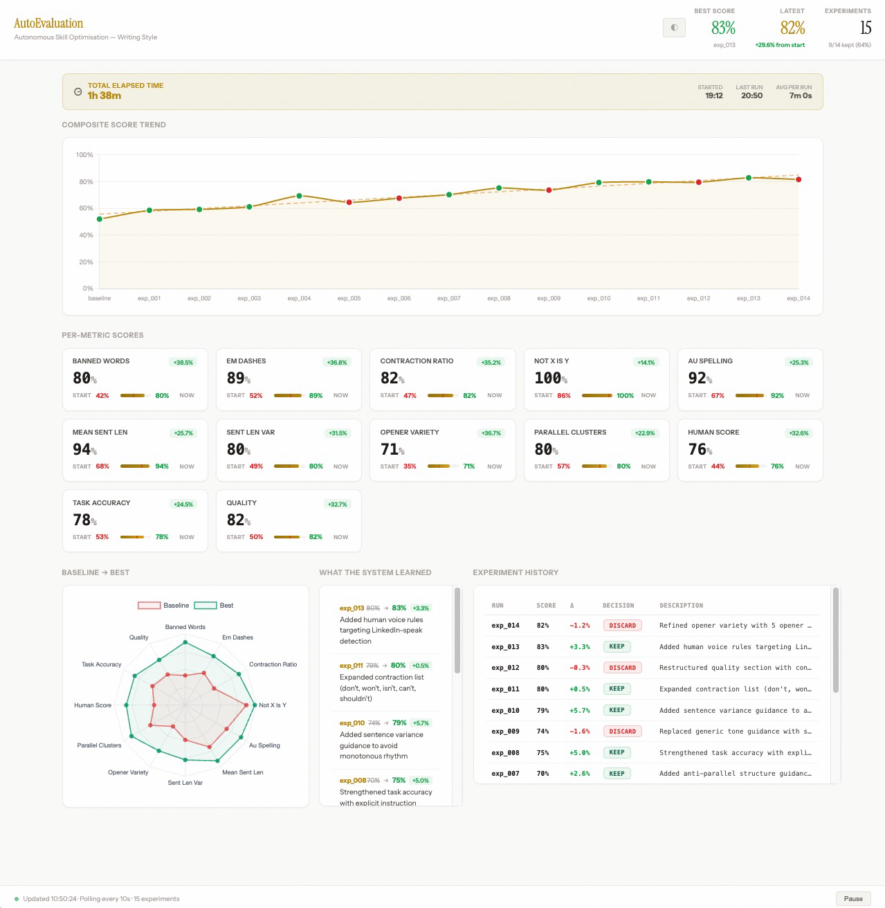

# AutoEvaluation

**Evals that fix themselves.**

Give it a prompt, a set of test scenarios, and a scoring rubric. It runs autonomously: generate outputs, score them, find the weakest metric, rewrite the prompt to fix it, re-score, keep or revert. Hill-climbing on prompt engineering, fully hands-off.

I pointed it at a writing style guide and let it run overnight. It made 20 attempts, kept 2, and improved the composite score from 0.9508 to 0.9692. The changes it made: strengthened contraction rules, added concrete before/after examples for em dash replacement. Every other LLM prompt optimiser (DSPy, TextGrad, MIPRO) requires you to write Python. This one works on plain markdown files.

Point it at any LLM instruction set. Go to bed. Wake up with a measurably better prompt.

## How it works

```
┌─────────────────────────────────────────────────────┐
│                  OPTIMISATION LOOP                  │
│                                                     │
│   ┌──────────┐    ┌──────────┐    ┌──────────┐      │
│   │ Analyse  │───▶│  Modify  │───▶│ Evaluate │      │
│   │ weakness │    │ SKILL.md │    │ samples  │      │
│   └──────────┘    └──────────┘    └──────────┘      │
│        ▲                               │            │
│        │          ┌──────────┐         │            │
│        └──────────│  Decide  │◀────────┘            │
│                   │ keep/rev │                      │
│                   └──────────┘                      │
└─────────────────────────────────────────────────────┘
```

1. **Analyse** — reads the weakest metrics from the last run
2. **Modify** — makes ONE targeted change to the skill instructions
3. **Evaluate** — generates outputs using the modified skill, scores them against your rubric
4. **Decide** — if the score improved, keep the change; otherwise revert
5. **Repeat** — until the iteration/time limit is hit (or indefinitely)

### Real results

I ran AutoEvaluation on an anti-AI writing style guide (the included example) for 20 iterations using Gemini 2.5 Flash:

```
Iteration   Score    Decision   What the AI changed
─────────   ─────    ────────   ────────────────────────────────────────────
baseline    0.9508   —          Starting point
exp_002     0.9600   KEEP       Strengthened contraction rule with emphasis
exp_005     0.9692   KEEP       Added concrete em-dash before/after example
```

18 of 20 attempts were discarded (score didn't improve). The 2 that stuck made targeted, specific changes. Total run time: ~2 hours. Total API cost: <$2.

The full experiment history is in `examples/writing-style/sample-results.tsv`.



## Quick start

### Prerequisites

- Python 3.10+
- An API key for your preferred LLM provider (Gemini, OpenAI, or Anthropic)

### One command start

```bash
git clone https://github.com/AdenCJM/AutoEvaluation.git
cd AutoEvaluation
echo "GEMINI_API_KEY=your-key" > .env
./start.sh
```

`start.sh` handles everything: creates a virtual environment (works with `uv` or `pip`), installs dependencies, validates your API key, runs setup if needed, and starts the optimisation loop. If anything is wrong — missing key, bad key, missing config — it tells you immediately.

> **Using OpenAI or Anthropic?** The default config uses Gemini. If you're using a different provider, set the matching key in `.env` (e.g. `OPENAI_API_KEY=your-key`) and update the `provider` field in `config.yaml` before running. See [BYO model](#byo-model).

### Try the included example

The repo ships with a complete working example (a writing style guide):

```bash
echo "GEMINI_API_KEY=your-key" > .env
cp examples/writing-style/SKILL.md SKILL.md
cp examples/writing-style/config.yaml config.yaml
cp examples/writing-style/prompts.json prompts/prompts.json
cp examples/writing-style/eval_deterministic.py tools/eval_deterministic.py
./start.sh
```

> **Using OpenAI or Anthropic?** The example `config.yaml` hardcodes Gemini. After copying it, open `config.yaml` and update `provider`, `model`, and `api_key_env` to match your provider. See [BYO model](#byo-model) for the exact values.

### Point at your own skill

Already have a skill file you want to optimise? Two options:

**Quick (no prompts, all defaults):**
```bash
echo "GEMINI_API_KEY=your-key" > .env
python3 setup.py --defaults --skill-file /path/to/your/SKILL.md --generate-prompts
./start.sh
```

This validates your API key, uses AI to generate test prompts from your skill file, applies sensible defaults (3 evaluation dimensions, 10 iterations), and you're running.

**Guided (interactive wizard):**
```bash
python3 tools/run_loop.py --skill path/to/your/SKILL.md --provider gemini --iterations 10
```

This auto-generates `config.yaml` with sensible defaults and starts optimising immediately.

### Setup wizard

```bash
python3 setup.py
```

The wizard walks you through:
1. **Provider + model** — pick Gemini, OpenAI, or Anthropic (API key validated instantly)
2. **Your skill** — paste or describe the instructions you want to optimise
3. **Test prompts** — AI generates prompts from your skill description, or enter manually
4. **Eval rubric** — set 2-5 quality dimensions (or use the defaults)
5. **Run duration** — max iterations, max hours, or unlimited

It generates: `config.yaml`, `SKILL.md`, `prompts/prompts.json`, `.env`, and `.claude/settings.json`.

**Skip all prompts:**

```bash
# All defaults — Gemini, default rubric, 5 generic prompts, 10 iterations
python3 setup.py --defaults

# Defaults with a custom skill and AI-generated prompts
python3 setup.py --defaults --skill-file SKILL.md --generate-prompts

# Defaults with OpenAI instead of Gemini
python3 setup.py --defaults --provider openai
```

**Already have a skill file?** Skip the paste step:

```bash
python3 setup.py --skill-file /path/to/your/SKILL.md
python3 setup.py --skill-file SKILL.md --prompts-file my-prompts.json
```

### With Claude Code (autonomous)

The recommended way to run AutoEvaluation is headless via `./start.sh` or `python3 tools/run_loop.py` directly.

If you want Claude Code to drive the loop (making its own hypothesis and strategy decisions), run this from your terminal — not from inside a Claude Code chat session:

```bash
python3 setup.py    # or use --defaults
claude -p program.md
```

Claude reads `program.md`, which contains the loop instructions. It autonomously runs experiments, modifies your skill, and tracks results. All bash commands are auto-approved via `.claude/settings.json`.

> **Note:** `claude -p program.md` spawns a new Claude Code process from the terminal. It does not run inside an existing Claude chat. If `claude -p` just prints the file instead of executing it, use the headless path instead: `python3 tools/run_loop.py`.

### Watch scores in real time

Open another terminal:

```bash
python3 tools/dashboard_server.py
```

Then open http://localhost:8050 in your browser.

---

## Test prompts

Test prompts are realistic tasks that exercise your skill. Create `prompts/prompts.json`:

```json
[
  {
    "id": "intro_email",
    "genre": "cold outreach",
    "prompt": "Write a 200-word cold email to a VP of Engineering introducing our product."
  },
  {
    "id": "follow_up",
    "genre": "cold outreach",
    "prompt": "Write a 150-word follow-up email after no response to the initial outreach."
  }
]
```

Each prompt needs:
- `id` — short identifier (used in filenames)
- `genre` — category (used for context in evaluation)
- `prompt` — the actual task the LLM will perform using your skill

Aim for 5-10 prompts that cover different aspects of your skill. More prompts = more reliable scores, but each one costs an LLM call per iteration.

---

## Example: writing style

The `examples/writing-style/` directory contains a complete working example that optimises an anti-AI writing style skill.

```bash
cp examples/writing-style/SKILL.md SKILL.md
cp examples/writing-style/prompts.json prompts/prompts.json
cp examples/writing-style/eval_deterministic.py tools/eval_deterministic.py
cp examples/writing-style/config.yaml config.yaml
# Edit .env with your API key, then:
python3 tools/run_loop.py
```

---

## Example interaction flow

Here's what happens when you run the optimisation loop.

### 1. Baseline

The first run establishes your starting score:

```
[1/3] Generating samples...
  [1/5] Generating: intro_email (cold outreach)... done (187 words, 3.2s)
  ...
[2/3] Running LLM judge evaluation...
[3/3] Aggregating scores...
COMPOSITE SCORE: 0.6420
```

### 2. Optimisation iterations

The loop analyses weaknesses, modifies `SKILL.md`, and re-evaluates:

```
Hypothesis: "task_accuracy is low because the skill doesn't specify email length constraints"
Change: Added "Keep emails under 200 words" rule
Running exp_001...
COMPOSITE SCORE: 0.7185
KEEP — score improved from 0.6420 to 0.7185
```

```
Running exp_002... COMPOSITE SCORE: 0.7340 — KEEP
Running exp_003... COMPOSITE SCORE: 0.7120 — DISCARD (reverted)
Running exp_004... COMPOSITE SCORE: 0.7510 — KEEP
...
Optimisation complete — 20 iterations in 1.3 hours
Best score: 0.7510
```

### 3. Results

- `SKILL.md.best` — your optimised skill (highest-scoring version)
- `results.tsv` — full experiment history

---

## BYO model

AutoEvaluation works with any LLM provider. Set your provider in `config.yaml`:

```yaml
# Gemini
provider: gemini
model: gemini-2.5-flash
api_key_env: GEMINI_API_KEY

# OpenAI
provider: openai
model: gpt-4o
api_key_env: OPENAI_API_KEY

# Anthropic
provider: anthropic
model: claude-sonnet-4-20250514
api_key_env: ANTHROPIC_API_KEY
```

Add your API key to `.env`:
```
OPENAI_API_KEY=sk-abc123...
```

To add a custom provider, edit `tools/model_client.py` — it's a single file with an `elif` block per provider.

---

## Run duration

Control how long the loop runs via CLI flags or `config.yaml`:

```bash
python3 tools/run_loop.py --iterations 20
python3 tools/run_loop.py --hours 2.5
```

Or in `config.yaml`:
```yaml
max_iterations: 20    # stop after 20 experiments
max_hours: 2.5        # stop after 2.5 hours
```

If both are set, whichever limit is hit first stops the loop. Set both to `0` for unlimited.

---

## Custom deterministic metrics (advanced)

By default, AutoEvaluation uses LLM-as-judge for all evaluation. If you want rule-based metrics too:

1. Create a custom `tools/eval_deterministic.py` that returns JSON:
   ```python
   {"metric_name": {"score": 0.85, ...}, "another_metric": {"score": 0.92, ...}}
   ```
2. Add them to `config.yaml`:
   ```yaml
   deterministic_metrics:
     - name: metric_name
       weight: 0.15
     - name: another_metric
       weight: 0.10
   ```

See `examples/writing-style/` for a full example with 9 deterministic metrics.

---

## Advanced features

### Separate judge model

By default, the same model generates outputs and evaluates them. This creates self-judging bias. Use a different model for evaluation:

```yaml
judge_provider: openai
judge_model: gpt-4o
judge_api_key_env: OPENAI_API_KEY
```

If these keys are absent, the primary provider is used as a fallback.

### Semi-blind judge

The judge normally evaluates outputs blind — it doesn't see your SKILL.md. Enable semi-blind mode to give the judge context for the `task_accuracy` dimension only:

```yaml
judge_sees_skill: true
```

Other dimensions (quality, human_score, etc.) are still evaluated blind.

### Convergence detection

Stop automatically when the optimiser plateaus:

```yaml
convergence_window: 10   # stop after 10 iterations with no improvement
```

Set to `0` to disable (default).

### Cost capping

Set a budget limit on estimated API spend:

```yaml
max_cost_usd: 5.00   # stop when estimated cost exceeds $5
```

Cost is estimated from token counts and known per-token pricing. Set to `0` for unlimited (default).

### Parallel execution

Speed up generation and evaluation by running multiple LLM calls concurrently:

```yaml
max_concurrent: 4   # run 4 API calls in parallel
```

Partial failures are handled gracefully — if 1 of 10 calls fails, the other 9 still count. Set to `1` for serial execution (default).

---

## Always-on mode (GitHub Actions)

Want the optimisation to run on a schedule? Copy the included workflow into your repo:

```bash
mkdir -p .github/workflows
cp examples/github-actions/optimise.yml .github/workflows/optimise.yml
```

Then:
1. Push to GitHub
2. Go to **Settings > Secrets > Actions** and add a secret called `LLM_API_KEY` with your API key
3. The workflow runs daily at 2am UTC (or trigger it manually from the Actions tab)

Each run checks out the repo, runs N iterations, and commits the updated `SKILL.md.best` and `results.tsv`.

See `examples/github-actions/README.md` for full setup instructions and schedule customisation.

---

## Project structure

```
autoevaluation/
├── setup.py                  # Setup wizard (also accepts --skill-file flags)
├── config.yaml               # All settings (generated by setup.py or --skill flag)
├── config.template.yaml      # Reference config with all options documented
├── program.md                # Loop instructions for Claude Code
├── SKILL.md                  # The skill being optimised (your instructions)
├── SKILL.md.best             # Current best version (auto-managed)
├── results.tsv               # Full experiment history
├── .env                      # API key (git-ignored)
├── .claude/settings.json     # Auto-approve rules for Claude Code (generated by setup.py, gitignored)
├── prompts/
│   └── prompts.json          # Test scenarios
├── tools/
│   ├── utils.py              # Shared utilities (config loading, validation)
│   ├── model_client.py       # LLM provider abstraction (retry, token tracking)
│   ├── experiment_runner.py  # Orchestrator (one eval cycle)
│   ├── generate_samples.py   # Sample generator
│   ├── eval_deterministic.py # Rule-based metrics (optional, customisable)
│   ├── eval_llm_judge.py     # LLM-as-judge metrics
│   ├── score_aggregator.py   # Weighted composite scoring
│   ├── run_loop.py           # Standalone loop driver (headless)
│   └── dashboard_server.py   # Live score dashboard
├── examples/
│   ├── writing-style/        # Full example: anti-AI writing style
│   └── github-actions/       # GitHub Actions workflow (opt-in)
└── .gitignore
```

## Acknowledgment

This project is inspired by [Karpathy's AutoResearch](https://github.com/karpathy/autoresearch), which explores autonomous research workflows. AutoEvaluation borrows the core idea of an autonomous optimisation loop but applies it to a different problem: making LLM instructions measurably better through iterative prompt engineering. It doesn't implement or extend AutoResearch's original scope — it's a separate tool that took the "point it at a problem and let it hill-climb" concept and ran with it in a new direction.
