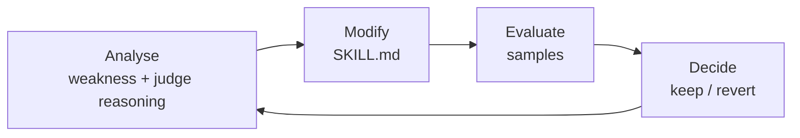
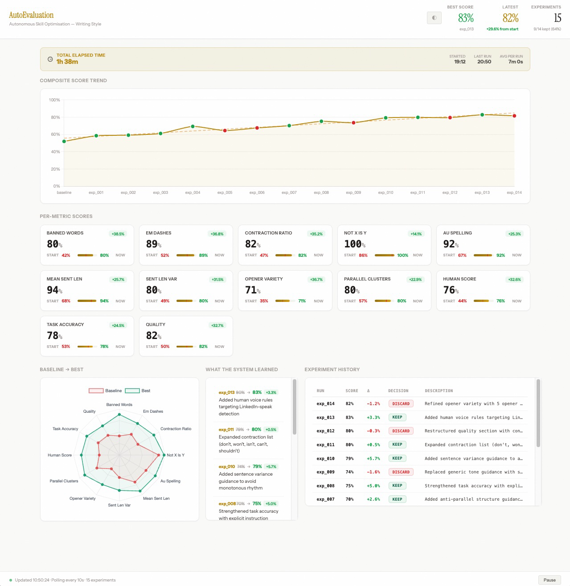

# AutoEvaluation

**Evals that fix themselves.**

Give it a prompt, a set of test scenarios, and a scoring rubric. It runs autonomously: generate outputs, score them, read the judge's reasoning, find the weakest metric, rewrite the prompt to fix it, re-score, keep or revert. Hill-climbing on prompt engineering, fully hands-off.

I pointed an earlier version at a writing style guide overnight. It made 20 attempts, kept 2, and improved its selected composite score from 0.9508 to 0.9692. The useful difference is the interface: AutoEvaluation works directly on plain Markdown instruction files, with no application DSL required. That historical run demonstrates the workflow; the included benchmark protocol defines the stronger evidence required for current statistical claims.

Point it at any LLM instruction set. Go to bed. Wake up with a measurably better prompt.

## Documentation

- **[Getting Started](docs/GETTING_STARTED.md)** — Step-by-step tutorial from clone to first optimisation
- **[Configuration Reference](docs/CONFIG_REFERENCE.md)** — Complete guide to every config.yaml option
- **[Troubleshooting Guide](docs/TROUBLESHOOTING.md)** — Common issues, entry point decisions, and fixes
- **[Architecture & Design](docs/ARCHITECTURE.md)** — Why the system works this way, design trade-offs, and signal flow
- **[Scheduled & Unattended Runs](docs/SCHEDULED_RUNS.md)** — `/loop`, Routines, cron, and the nightly regression sweep
- **[Walkthrough](walkthrough.md)** — A historical new-user test report from an early version of the tool

## How it works


```mermaid
graph LR
    A["Analyse<br/>weakness + judge reasoning"] --> B["Modify<br/>SKILL.md"]
    B --> C["Evaluate<br/>samples"]
    C --> D["Decide<br/>keep / revert"]
    D --> A
```

1. **Analyse** — reads the weakest metrics AND the actual sample outputs that scored poorly, including the judge's reasoning for each score. The modifier sees *why* scores are low, not just numbers.
2. **Modify** — makes ONE targeted change to the skill instructions, grounded in concrete failure examples.
3. **Evaluate** — generates outputs using the modified skill, scores them against your rubric.
4. **Decide** — a hierarchical bootstrap resamples prompts and stochastic replicates. An alpha-spending schedule controls repeated testing across arbitrarily long or resumed runs, and a separate validation split gates prospective KEEPs.
5. **Repeat** — until the iteration, time, or cost limit is hit (or indefinitely).

### What makes this different

Most prompt-optimisation frameworks are code- or platform-centric. DSPy, for example, expresses optimisable programs in Python; hosted optimisers are commonly tied to one provider. AutoEvaluation is deliberately file-native: its optimisation target is an ordinary Markdown instruction document.

AutoEvaluation treats prompts as prose documents that an LLM reads, critiques, and rewrites. No DSL. No compilation step. No framework lock-in. Just a markdown file and test prompts. It's "editor doing revision" vs "compiler doing gradient descent."

### Historical result

I ran AutoEvaluation on an anti-AI writing style guide (the included example) for 20 iterations using Gemini 2.5 Flash:

```
Iteration   Score    Decision   What the AI changed
─────────   ─────    ────────   ────────────────────────────────────────────
baseline    0.9508   —          Starting point
exp_002     0.9600   KEEP       Strengthened contraction rule with emphasis
exp_005     0.9692   KEEP       Added concrete em-dash before/after example
```

18 of 20 attempts were discarded by the earlier threshold-based decision rule. The 2 that stuck made targeted, specific changes. Total run time was about two hours and estimated API cost was under $2.

The full experiment history is in `examples/writing-style/sample-results.tsv`. This run predates hierarchical bootstrap, sequential correction, and untouched final-test reporting, so it demonstrates the product workflow rather than validating the current statistical method. New benchmark runs should follow `examples/writing-style/BENCHMARK.md`.



## Quick start

### Prerequisites

- Python 3.10+
- An API key for your preferred LLM provider (Gemini, OpenAI, or Anthropic)

### Three ways to run it

1. **`/autoeval` in Claude Code (recommended)** — conversational setup, then a live dashboard, then autopilot. `start.sh` installs the skill automatically into `~/.claude/skills/`, so once you've run it once, just type `/autoeval` in Claude Code inside the project.
2. **`python3 setup.py` + `python3 tools/run_loop.py`** — the interactive wizard followed by the headless driver. No Claude Code dependency.
3. **`./start.sh`** — auto-detects your environment (Claude Code available or not) and picks the right path for you.

Want it running unattended overnight, on a schedule, or on a server? See [Scheduled & unattended runs](docs/SCHEDULED_RUNS.md).

See the [Getting Started guide](docs/GETTING_STARTED.md) for a full walkthrough, or [walkthrough.md](walkthrough.md) for a real first-run report.

### One command start

```bash
git clone https://github.com/AdenCJM/AutoEvaluation.git
cd AutoEvaluation
echo "GEMINI_API_KEY=your-key" > .env
./start.sh
```

`start.sh` handles everything: checks your Python version, creates a virtual environment, installs only the provider SDK you need (not all three), validates your API key, installs the `/autoeval` skill, runs setup if needed, and starts the optimisation loop. If anything is wrong, it tells you immediately.

### Try the included example

The repo ships with a complete working example (a writing style guide):

```bash
echo "GEMINI_API_KEY=your-key" > .env
cp examples/writing-style/SKILL.md SKILL.md
cp examples/writing-style/config.yaml config.yaml
cp examples/writing-style/prompts.json prompts/prompts.json
cp examples/writing-style/eval_deterministic.py tools/eval_deterministic.py
./start.sh
```

### Point at your own skill

Already have a skill file you want to optimise? Two options:

**Quick (no prompts, all defaults):**
```bash
echo "GEMINI_API_KEY=your-key" > .env
python3 setup.py --defaults --skill-file /path/to/your/SKILL.md --generate-prompts
./start.sh
```

This validates your API key, uses AI to generate test prompts from your skill file, applies sensible defaults (3 evaluation dimensions, 10 iterations), and you're running.

**Guided (interactive wizard):**
```bash
python3 tools/run_loop.py --skill path/to/your/SKILL.md --provider gemini --iterations 10
```

This auto-generates `config.yaml` with sensible defaults and starts optimising immediately.

### Setup wizard

```bash
python3 setup.py
```

The wizard walks you through:
1. **Provider + model** — pick Gemini, OpenAI, or Anthropic (API key validated instantly)
2. **Your skill** — paste or describe the instructions you want to optimise
3. **Test prompts** — AI generates prompts from your skill description, or enter manually
4. **Eval rubric** — set 2-5 quality dimensions (or use the defaults)
5. **Run duration** — max iterations, max hours, or unlimited

It generates: `config.yaml`, `SKILL.md`, `prompts/prompts.json`, `.env`, and `.claude/settings.json`.

**Skip all prompts:**

```bash
# All defaults: Gemini, default rubric, 30 diverse prompts, 10 iterations
python3 setup.py --defaults

# Defaults with a custom skill and AI-generated prompts
python3 setup.py --defaults --skill-file SKILL.md --generate-prompts

# Defaults with OpenAI instead of Gemini
python3 setup.py --defaults --provider openai
```

**Already have a skill file?** Skip the paste step:

```bash
python3 setup.py --skill-file /path/to/your/SKILL.md
python3 setup.py --skill-file SKILL.md --prompts-file my-prompts.json
```

### With Claude Code (autonomous)

If you have [Claude Code](https://docs.anthropic.com/en/docs/claude-code) installed, the `/autoeval` skill drives the optimisation loop autonomously:

```bash
python3 setup.py    # or use --defaults, or let /autoeval do this conversationally
```

Then, inside Claude Code:

```
/autoeval
```

The skill runs conversational setup, offers the dashboard, then delegates execution to the crash-safe headless driver described by `program.md`.

`tools/run_loop.py` is the executable source of truth for state transitions. `program.md` is the agent-facing runbook that deliberately delegates to it, preventing two loop implementations from drifting.

### Watch scores in real time

Open another terminal:

```bash
python3 tools/dashboard_server.py
```

Then open http://localhost:8050 in your browser.

---

## How the optimiser thinks

The optimisation loop doesn't just look at score numbers. For each iteration, it:

1. **Reads the judge's reasoning** for the 2 worst-scoring samples. Not "task_accuracy = 0.72" but "the output ignored the instruction to avoid em dashes in paragraph 3."
2. **Reads the actual sample text** that scored poorly, so it can see the concrete failure.
3. **Makes one targeted change** based on that specific failure, not a guess from numbers.
4. **Validates the returned skill** hasn't been truncated or corrupted (checks frontmatter, section headers).
5. **Models both sources of noise**: each prompt runs `replicates_per_prompt` completions, and a hierarchical bootstrap resamples prompts plus replicate scores. Runs with fewer than eight shared training prompts explicitly degrade to a threshold rule rather than claiming significance.
6. **Controls repeated testing**: an alpha-spending schedule keeps the cumulative false-positive budget bounded across resumed campaigns.
7. **Separates selection from final evidence**: validation prompts gate KEEPs; a distinct final-test split is scored at baseline and once at completion, never used by the optimiser.

This means the headless mode (`run_loop.py`) is just as effective as the Claude Code mode. Both see the same signal.

---

## Test prompts

Test prompts are realistic tasks that exercise your skill. Create `prompts/prompts.json`:

```json
[
  {
    "id": "intro_email",
    "genre": "cold outreach",
    "prompt": "Write a 200-word cold email to a VP of Engineering introducing our product."
  },
  {
    "id": "follow_up",
    "genre": "cold outreach",
    "prompt": "Write a 150-word follow-up email after no response to the initial outreach."
  }
]
```

Each prompt needs:
- `id` — short identifier (alphanumeric, underscores, hyphens; auto-sanitised)
- `genre` — category (used for context in evaluation)
- `prompt` — the actual task the LLM will perform using your skill

Use about 30 prompts spanning realistic cases, constraints, and edge conditions. The generated default allocates 30% to validation and 20% to the untouched final test, leaving 15 training prompts. Smaller suites still run, but fewer than eight training prompts use degraded threshold mode.

---

## BYO model

AutoEvaluation works with any LLM provider. Set your provider in `config.yaml`:

```yaml
# Gemini
provider: gemini
model: gemini-3.5-flash
api_key_env: GEMINI_API_KEY

# OpenAI
provider: openai
model: gpt-5.4
api_key_env: OPENAI_API_KEY

# Anthropic
provider: anthropic
model: claude-sonnet-5
api_key_env: ANTHROPIC_API_KEY
```

Add your API key to `.env`:
```
OPENAI_API_KEY=sk-abc123...
```

To add a custom provider, edit `tools/model_client.py`. It's a single file with an `elif` block per provider.

---

## Run duration

Control how long the loop runs via CLI flags or `config.yaml`:

```bash
python3 tools/run_loop.py --iterations 20
python3 tools/run_loop.py --hours 2.5
```

Or in `config.yaml`:
```yaml
max_iterations: 20    # stop after 20 experiments
max_hours: 2.5        # stop after 2.5 hours
```

If both are set, whichever limit is hit first stops the loop. Set both to `0` for unlimited.

---

## Custom deterministic metrics (advanced)

By default, AutoEvaluation uses LLM-as-judge for all evaluation. If you want rule-based metrics too:

1. Create a custom `tools/eval_deterministic.py` that returns JSON:
   ```python
   {"metric_name": {"score": 0.85, ...}, "another_metric": {"score": 0.92, ...}}
   ```
2. Add them to `config.yaml`:
   ```yaml
   deterministic_metrics:
     - name: metric_name
       weight: 0.15
     - name: another_metric
       weight: 0.10
   ```

See `examples/writing-style/` for a full example with 9 deterministic metrics.

---

## Advanced features

### Separate judge model

By default, the same model generates outputs and evaluates them. This creates self-judging bias (the tool will warn you about this). Using a separate, cheaper model for evaluation is a first-class recommendation:

```yaml
judge_provider: anthropic
judge_model: claude-haiku-4-5
judge_api_key_env: ANTHROPIC_API_KEY
```

If these keys are absent, the primary provider is used as a fallback, with a warning.

### Semi-blind judge

`judge_sees_skill` defaults to `true` (semi-blind mode is recommended): the judge sees `SKILL.md` for the `task_accuracy` dimension only.

```yaml
judge_sees_skill: true   # default
```

Other dimensions (quality, natural_voice, etc.) are still evaluated blind. Set to `false` for fully blind evaluation if you want to eliminate any chance of the judge being influenced by the skill text.

### Noise-aware decisions

The optimiser doesn't compare bare score deltas. Each experiment runs `replicates_per_prompt` completions per prompt, then hierarchically resamples prompts and replicates. An alpha-spending schedule tightens the effective confidence as a campaign accumulates candidate tests, including after resume.

```yaml
replicates_per_prompt: 3   # completions per prompt per experiment
accept_rule: paired        # hierarchical decision (default); "simple" preserves the legacy threshold
accept_confidence: 0.95    # base confidence before repeated-testing correction
sequential_correction: true
```

The generated configuration uses a validation slice (`holdout_fraction: 0.3`) to gate prospective KEEPs and an untouched final slice (`final_test_fraction: 0.2`) that is never used for selection. Run `python3 tools/run_loop.py --measure-noise 3` to inspect your own score variability.

### Convergence detection

Stop automatically when the optimiser plateaus:

```yaml
convergence_window: 10   # stop after 10 iterations with no improvement above threshold
```

Set to `0` to disable (default).

### Cost capping

Set a budget limit on estimated API spend:

```yaml
max_cost_usd: 5.00   # stop when estimated cost exceeds $5
```

Calls that return usage metadata are recorded with their serving model and priced independently across generation, evaluation, and modification. The loop avoids starting another iteration when its projected cost would cross the cap. Unknown model pricing is reported as incomplete and prevents startup when a cap is configured. Actual provider billing and a first iteration without cost history can still differ from the estimate. Set `0` for unlimited.

### Parallel execution

Speed up generation and evaluation by running multiple LLM calls concurrently:

```yaml
max_concurrent: 4   # run 4 API calls in parallel
```

Partial failures are handled gracefully. If 1 of 10 calls fails, the other 9 still count. Set to `1` for serial execution (default).

---

## Subscription mode (experimental)

`.claude/workflows/autoeval-eval.js` runs one evaluation pass entirely through Claude Code subagents — generation and judging both happen as subagent calls inside the session, needing no provider API key at all. Invoke it by asking Claude Code to "run the autoeval-eval workflow".

This is experimental. The scores come from whatever model is powering the current Claude Code session, so they are **not comparable** with scores produced by the API-provider path (`generate_samples.py` / `eval_llm_judge.py` against `config.yaml`'s configured provider). Treat it as a no-API-key way to sanity-check a `SKILL.md` change, not as a substitute for the main loop's scoring.

## Always-on mode (GitHub Actions)

Want the optimisation to run on a schedule? Copy the included workflow into your repo:

```bash
mkdir -p .github/workflows
cp examples/github-actions/optimise.yml .github/workflows/optimise.yml
```

Then:
1. Force-add and commit the non-secret configuration: `git add -f config.yaml`
2. Push to GitHub
3. Go to **Settings > Secrets > Actions** and add a secret called `LLM_API_KEY` with your API key
4. The workflow runs daily at 2am UTC (or trigger it manually from the Actions tab)

Each run checks out the repo, runs N iterations, and force-adds the ignored run artefacts needed for crash-safe resumption. The non-secret `config.yaml` must also be committed explicitly; the example guide shows the command.

See `examples/github-actions/README.md` for full setup instructions and schedule customisation.

---

## Example interaction flow

Here's what happens when you run the optimisation loop.

### 1. Baseline

The first run establishes your starting score:

```
[1/3] Generating samples...
  [1/5] Generating: intro_email (cold outreach)... done (187 words, 3.2s)
  ...
[2/3] Running LLM judge evaluation...
[3/3] Aggregating scores...
COMPOSITE SCORE: 0.6420
Note: Using same model for generation and judging. For better signal, set judge_provider in config.yaml.
```

### 2. Optimisation iterations

The loop reads the judge's reasoning, analyses weaknesses, modifies `SKILL.md`, and re-evaluates:

```
Enriched context: 2 worst samples: sample_3_quick_reply, sample_0_intro_email
Analysing weaknesses and modifying skill...
Change: Added "Keep emails under 200 words" rule
Running exp_001 (3 replicates/prompt)...
COMPOSITE SCORE: 0.7185
KEEP — hierarchical bootstrap CI excludes zero at corrected confidence; validation non-regression confirmed
```

```
Running exp_002... COMPOSITE SCORE: 0.7340 — KEEP
Running exp_003... COMPOSITE SCORE: 0.7120 — DISCARD (CI includes zero, not distinguishable from noise)
Running exp_004... COMPOSITE SCORE: 0.7510 — KEEP
...
Optimisation complete — 20 iterations in 1.3 hours
Best score: 0.7510
```

### 3. Results

```
============================================================
  RUN COMPLETE
============================================================
  Iterations run:   20
  Time elapsed:     1h 23m 15s
  Cost estimate:    $1.4200
  Tokens used:      2,100,000 in / 890,000 out

  Baseline score:   0.6420
  Best score:       0.7510  (+0.1090)

  Kept changes (4):
  · [exp_001] Added email length constraint
  · [exp_002] Specified greeting format
  · [exp_004] Added concrete example of good vs bad sign-off
  · [exp_012] Restructured rules by priority

  Best skill saved: SKILL.md.best
============================================================
```

---

## Project structure

```
autoevaluation/
├── setup.py                  # Setup wizard (also accepts --skill-file flags)
├── start.sh                  # Zero-friction entry point
├── config.yaml               # All settings (generated by setup.py or --skill flag)
├── config.template.yaml      # Reference config with all options documented
├── program.md                # Agent runbook delegating to the headless driver
├── SKILL.md                  # The skill being optimised (your instructions)
├── SKILL.md.best             # Current best version (auto-managed)
├── results.tsv               # Full experiment history
├── best_aggregate.json       # Best run's per-prompt scores, for paired comparison (gitignored)
├── best_holdout_aggregate.json  # Best run's holdout-set scores (gitignored)
├── .env                      # API key (git-ignored)
├── .env.example              # Template showing required keys
├── .claude/settings.json     # Auto-approve rules for Claude Code (gitignored)
├── prompts/
│   └── prompts.json          # Test scenarios
├── tools/
│   ├── utils.py              # Shared utilities (config, env loading, validation)
│   ├── model_client.py       # LLM provider abstraction (retry, token tracking, cost)
│   ├── experiment_runner.py  # Orchestrator (one eval cycle)
│   ├── generate_samples.py   # Sample generator (supports parallel)
│   ├── eval_deterministic.py # Rule-based metrics (optional, customisable)
│   ├── eval_llm_judge.py     # LLM-as-judge metrics
│   ├── score_aggregator.py   # Weighted composite scoring
│   ├── decision.py           # Hierarchical bootstrap, repeated-test correction, validation gate
│   ├── results_io.py         # results.tsv header-based read/update (CLI + library)
│   ├── run_loop.py           # Standalone loop driver (headless)
│   └── dashboard_server.py   # Live score dashboard
├── tests/
│   └── test_smoke.py         # 89 tests (import, config, judge parsing, aggregation, decision logic, loop logic)
├── examples/
│   ├── writing-style/        # Full example: anti-AI writing style
│   └── github-actions/       # GitHub Actions workflow (opt-in)
└── .gitignore
```

## Acknowledgment

This project is inspired by [Karpathy's AutoResearch](https://github.com/karpathy/autoresearch), which explores autonomous research workflows. AutoEvaluation borrows the core idea of an autonomous optimisation loop but applies it to a different problem: making LLM instructions measurably better through iterative prompt engineering.
